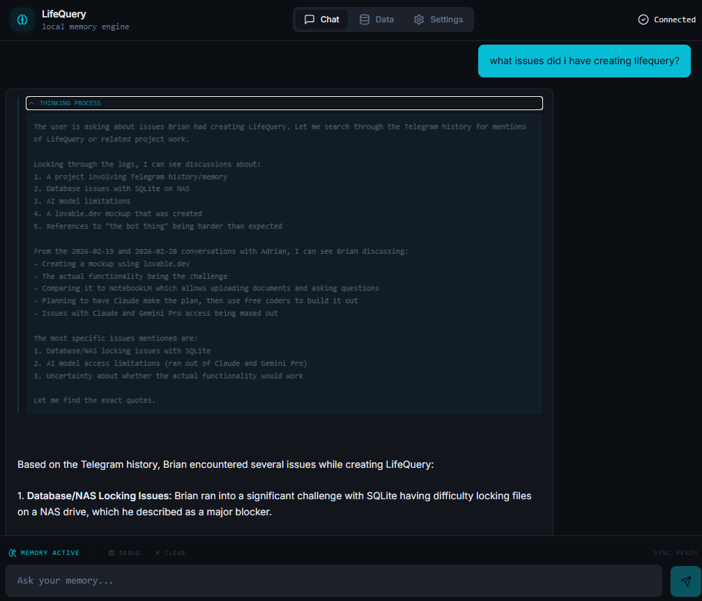
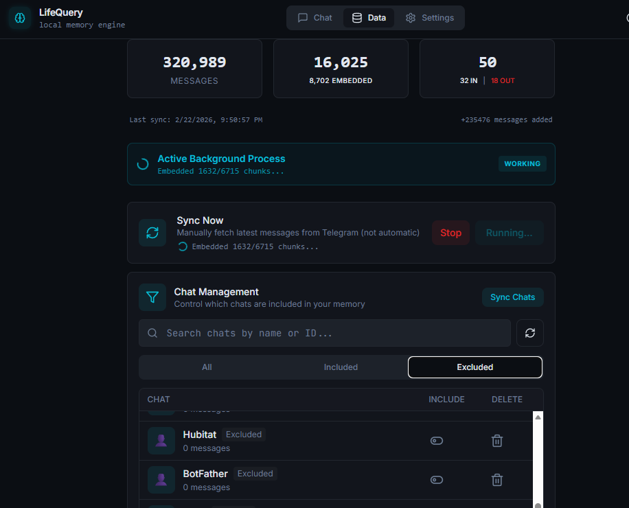
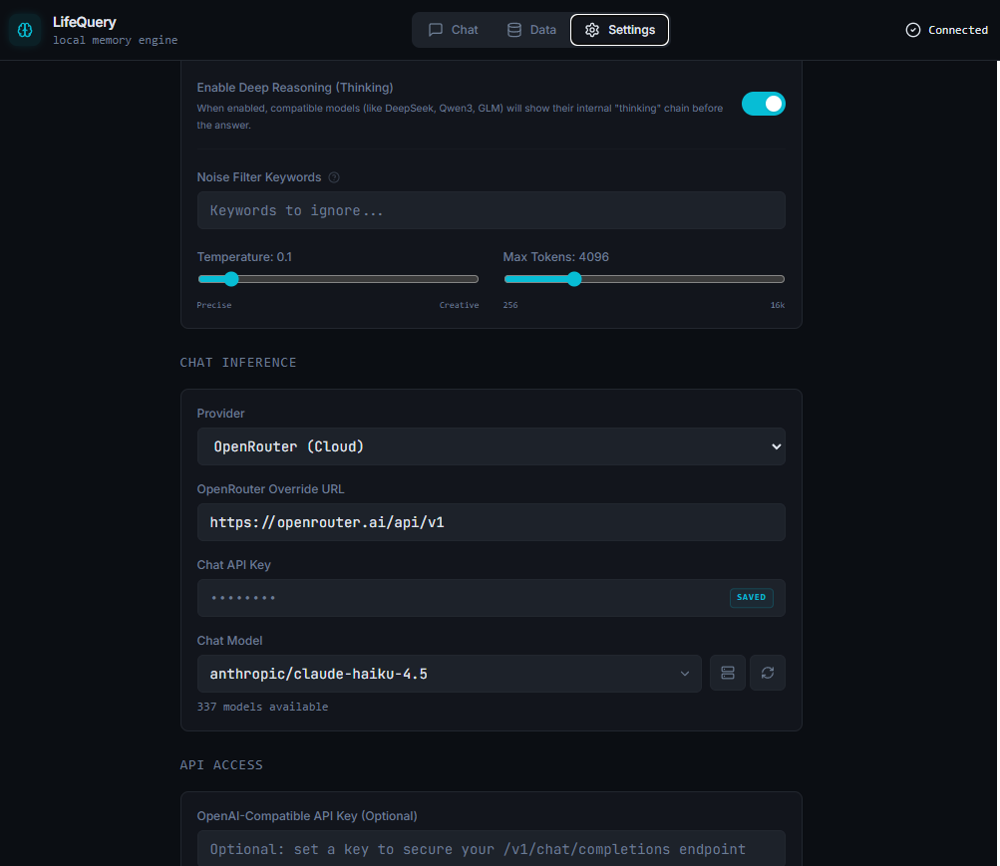
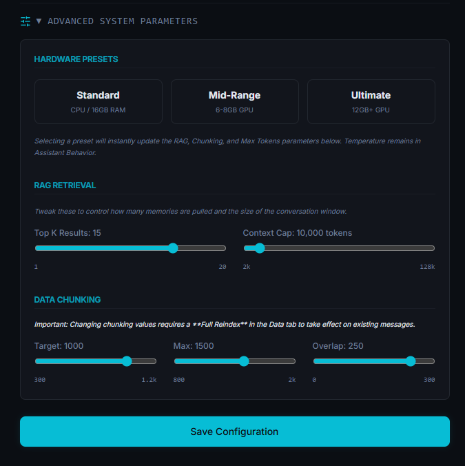

# LifeQuery

A self-hosted, local-first personal memory engine for your Telegram history. Ask questions about your past conversations in plain English and get cited, streaming answers — all running on your own hardware with no cloud dependency.

> See [`docs/USERGUIDE.md`](docs/USERGUIDE.md) for full feature documentation and user guide.
> See [`docs/ARCHITECTURE.md`](docs/ARCHITECTURE.md) for technical architecture and design decisions.

<br>

<div align="center">
  
  <br><br>
  
</div>

<br>

|  |  |
|---------------------------------------------------------|---------------------------------------------------------------|

<br>

---

## What it does

LifeQuery ingests your entire Telegram message history, chunks it into semantically coherent segments, embeds them into a local vector database, and lets you query them through a conversational chat interface. Answers are grounded in your actual messages, with source citations showing which chat and date range each piece of information came from.

- **Chat tab** — Ask anything about your past; get streaming answers with citations
- **Data tab** — Sync Telegram live, import JSON exports, manage which chats are included
- **Settings tab** — Configure your LLM provider, embedding model, RAG parameters, and Telegram credentials

---

## Prerequisites

- **Docker** and **Docker Compose**
- **Ollama** running and accessible (local or networked)
- **Telegram data** — either live API credentials (for live sync) or a JSON export from Telegram Desktop

---

## Quick Start

**1. Clone the repo**
```bash
git clone https://github.com/nikira-studio/lifequery.git
cd lifequery
```

**2. Configure your compose file**
```bash
cp docker-compose.example.yml docker-compose.yml
```

Edit `docker-compose.yml` and replace `/path/to/your/data` with a real directory on your host:
```yaml
volumes:
  - /home/username/lifequery-data:/app/data
```

**3. Pull models in Ollama**
```bash
# Embedding model (required)
ollama pull qwen3-Embedding-0.6B:Q8_0

# Chat model (pick one, or use whatever you have)
ollama pull qwen3:8b
```

**4. Start the stack**
```bash
docker compose up -d
```

**5. Open the UI**

Go to `http://localhost:3133`, then open **Settings** to enter your Ollama URL and Telegram credentials.

**Ollama URL:** The default is `http://ollama:11434`, which assumes Ollama is a Docker service named `ollama` in the same compose network. If you run Ollama separately, use:
- `http://host.docker.internal:11434` — Mac or Windows
- `http://172.17.0.1:11434` — Linux (host gateway), or your host's LAN IP

---

## Ports

| Service  | Host Port | Description                     |
|----------|-----------|---------------------------------|
| Frontend | 3133      | Web UI (React, served by nginx) |
| Backend  | 3134      | REST/SSE API (FastAPI)          |

---

## Getting your data in

**Option A — Live Telegram sync** (requires Telegram API credentials)

1. Get an API ID and hash from [my.telegram.org](https://my.telegram.org)
2. Enter them in Settings → Telegram
3. Authenticate with your phone number
4. Go to Data tab → **Sync Telegram**

**Option B — JSON import** (no API credentials needed)

1. In Telegram Desktop: Settings → Advanced → Export Telegram Data → select JSON format
2. Data tab → **Import JSON** → upload the exported file

After either import, the system automatically chunks and embeds your messages. Depending on history size, this can take a few minutes.

---

## Chat providers

Go to **Settings → Chat Inference** to choose a provider:

| Provider   | Notes                                              |
|------------|----------------------------------------------------|
| Ollama     | Default; runs locally; no API key required        |
| OpenAI     | Requires API key; set model (e.g. `gpt-4o-mini`)  |
| OpenRouter | Multi-model API; requires API key                 |
| MiniMax    | MiniMax API; requires API key                     |
| Z.AI (GLM) | Z.AI/GLM API; requires API key                    |
| Custom     | Any OpenAI-compatible endpoint                    |

---

## OpenAI-compatible API

LifeQuery exposes `/v1/chat/completions` compatible with any OpenAI client. Set base URL to `http://localhost:3134/v1`.

---

## Hardware requirements

|             | Minimum           | Recommended                    |
|-------------|-------------------|--------------------------------|
| RAM         | 16 GB             | 32 GB                          |
| GPU VRAM    | None (CPU mode)   | 8–12 GB (for local LLM)        |

---

## Troubleshooting

```bash
# View logs
docker compose logs -f backend
docker compose logs -f frontend

# Check health
curl http://localhost:3134/api/health

# Restart services
docker compose restart
```

---

## Data & upgrades

All user data lives in the host directory you mounted at `/app/data`:
- `data.db` — SQLite database (messages, chunks, settings)
- `logs/` — Application logs

ChromaDB uses a separate named Docker volume (`lifequery-chroma`). This volume contains only computed embedding vectors — not your original data. Your messages, chunks, and settings are all in `data.db` inside your data directory. If the ChromaDB volume is ever lost, run a reindex from the Data tab and the vectors will be rebuilt from your existing chunks (~20–30 minutes for a typical history).

---

## License

MIT
